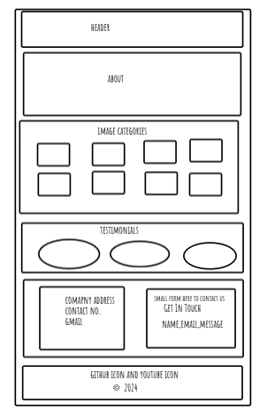

**GROUP 3**
**Week 5 Project Assignment: Design and Build a Full Stack Application**

---

## **USER STORIES**

_web fundamentals_

🐿️ As a user, I want the web page to have a clear structure with a recognizable header, footer, and navigation sections, so that I can easily navigate smoothly and understand the content.

🐿️ As a user, I want the website design to adjust using media queries so that it works well on both small mobile screens and larger desktop screens.

🐿️ As a user, I want the website to be visually impressive and user-friendly, so that it provides a pleasant browsing experience with easy access to galleries and testimonials.

🐿️ As a user, I want to have a “back to top” button so that I can easily return to the top without manually scrolling.

🐿️ As a user with accessibility needs, I expect accessible considerations like alternative text for images so my screen reader can interpret and convey the content to me effectively.

_programming logic_

🐿️ As a user, I want to view images organized into categories and be able to switch between them using buttons, so that I can easily explore the photography collections I’m interested in.

🐿️ As a user, I’d like to fill out a working testimonial form so that I can submit my feedback about the photography services effectively and without issues.

🐿️ As a developer, I want to create a working API GET route so that I can retrieve form data from the server and display it to the users in the testimonials.

🐿️ As a developer, I want to create a working API POST route so that users can submit their testimonials, and the data will be saved in the database (e.g., Supabase).

🐿️ As a developer, I want to integrate front-end components with an Express server and a Postgres database, including making Fetch calls to retrieve testimonials and handle submissions.

🐿️ As a developer, I want the submitted testimonials to be automatically displayed on the website after being stored in the database, so that the feedback appears in real-time without manual updates.

## **STRETCH GOALS**

🐿️ As a user, I want to use keyboard shortcuts, like arrow keys, to switch between images easily.

🐿️ As a user on various devices, I want to view and access the images easily for an optimal viewing experience, ensuring the layout adapts based on my device’s screen size.

---

<!-- user stories ends here -->

---

## **PROBLEM DOMAIN**

"Providing an interactive platform for showcasing photography collections by category, allowing users to easily explore images, submit testimonials, and view feedback, all while seamlessly storing and displaying submissions using a backend system."

---

<!-- problem domain ends here -->

---

## **WIREFRAMES**

---

<!-- wireframe ends here -->

---

## **TRELLO**

<!-- HERE TRELLO DETAILS PLEASE -->

---

<!--  -->

---

**GROUP DETAILS**

Collaboration was completed when the src images where sent by all team members in order for the image gallery to operate functionally.
The team had also decided on what css features to implement for an interactive and clear design.

The use of the Trello organsier siye was effective in making sure everyone knew their role, and what was had already been achieved by the group, as wel as what tasks remained.

Changes occured when the idea of adding a separate media query was implemented with an additional CSS page-specific for media queries.

It was important to understand git braching to use it effectively.
